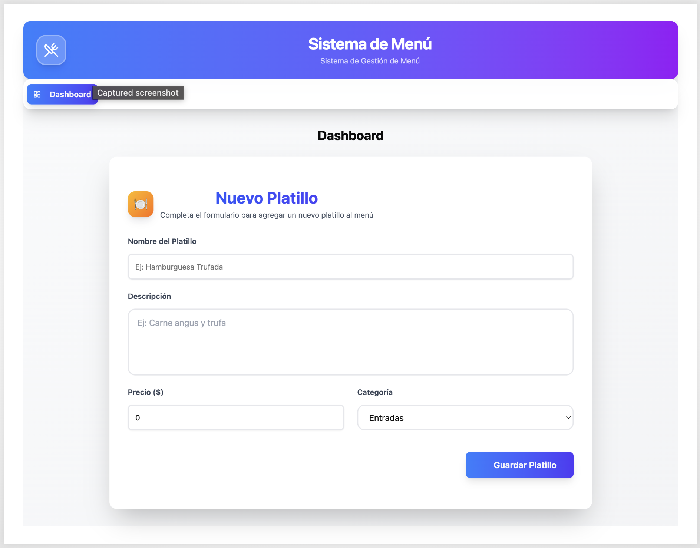
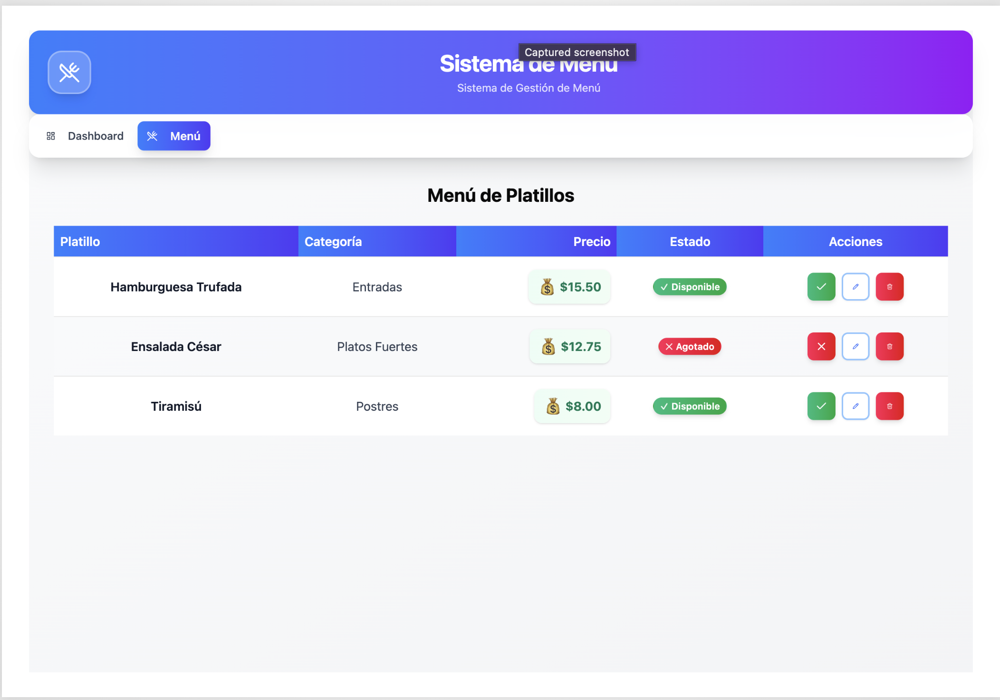

# Sistema de Menú de Restaurante

Aplicación web para gestionar el menú de un restaurante, permitiendo agregar, editar, eliminar y controlar la disponibilidad de platillos.

## Características

- **Dashboard**: Interfaz para agregar nuevos platillos al menú
- **Gestión de Menú**: Tabla interactiva con todos los platillos
- **Control de Disponibilidad**: Toggle para marcar platillos como disponibles o agotados
- **Eliminación de Platillos**: Funcionalidad para eliminar platillos del menú
- **Diseño Responsivo**: Interfaz adaptada para móviles y escritorio

## Screenshots

### Dashboard



### Menú de Platillos



## Instalación

1. Clona el repositorio:

```bash
git clone <url-del-repositorio>
cd restaurant-menu
```

2. Instala las dependencias:

```bash
yarn install
```

## Cómo correr el proyecto

### Modo Desarrollo

Para iniciar el servidor de desarrollo:

```bash
yarn dev
```

La aplicación estará disponible en `http://localhost:5173`

### Modo Producción

Para construir la aplicación para producción:

```bash
yarn build
```

## Scripts Disponibles

- `yarn dev` - Inicia el servidor de desarrollo
- `yarn build` - Construye la aplicación para producción

## Tecnologías

- **React 19+** - Biblioteca para la interfaz de usuario
- **TypeScript 5+** - Tipado estático en modo estricto
- **Vite** - Herramienta de construcción rápida
- **Tailwind CSS 4+** - Framework de CSS
- **shadcn/ui** - Componentes de UI reutilizables
- **zod** - Validación de formularios
- **React Hook Form** - Gestión de formularios
- **Lucide React** - Iconos

## Estructura del Proyecto

```
restaurant-menu/
├── src/
│   ├── components/
│   │   ├── features/        # Componentes de funcionalidades específicas
│   │   │   ├── dish-form/    # Formulario para agregar platillos
│   │   │   ├── dish-table/   # Tabla de platillos
│   │   │   └── availability/  # Control de disponibilidad
│   │   ├── layout/           # Componentes de layout
│   │   └── ui/               # Componentes UI de shadcn/ui
│   ├── hooks/                # Custom hooks de React
│   ├── App.tsx               # Componente principal
│   └── main.tsx              # Punto de entrada
├── public/                   # Archivos estáticos
├── img/                      # Imágenes del proyecto
└── package.json
```

## Desarrollo

El proyecto sigue las siguientes convenciones:

- TypeScript en modo estricto
- Componentes funcionales con hooks
- Tailwind CSS para estilos
- Validación de formularios con zod
- ESLint para linting

## Contribuciones

Las contribuciones son bienvenidas. Por favor, abre un issue o pull request para cualquier mejora.
